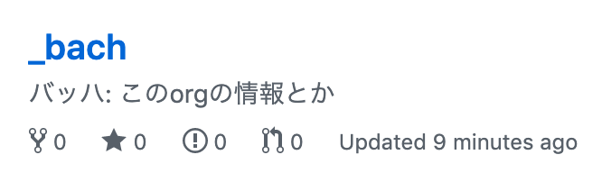

# _bach
バッハ: このorgの情報とか

## repo 命名規則
* いい感じの音楽家で
  * e.g.
    * bach
    * mozart
    * vivaldi
    * liszt

目的のとこに`{{.name_of_musician}}:これは{{.lecture}}講義のrepoです`的ないい感じのテキストを書いてほしい

## 2019 講義スケジュール
https://hackmd.io/4tfgHebPRxSoxFu95MaPvw

### member
* [name=glatan]
* [name=terfno]
* [name=agata]
